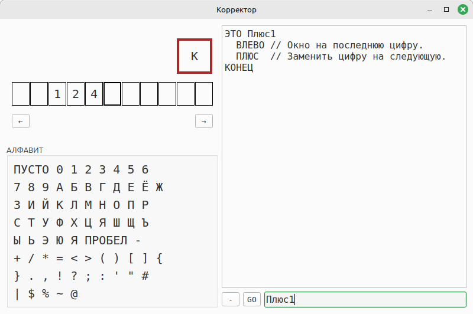

# Корректор
## Клон Роботландского исполнителя "Корректор"

## Версия 0.1.0



Так выглядел оригинал:


---

### Установка

```shell
$ git clone https://gitflic.ru/project/novaya-robotlandiya/korrektor.git
```

### Запуск

```shell
$ cd korrektor
$ python -m src.ui
```
